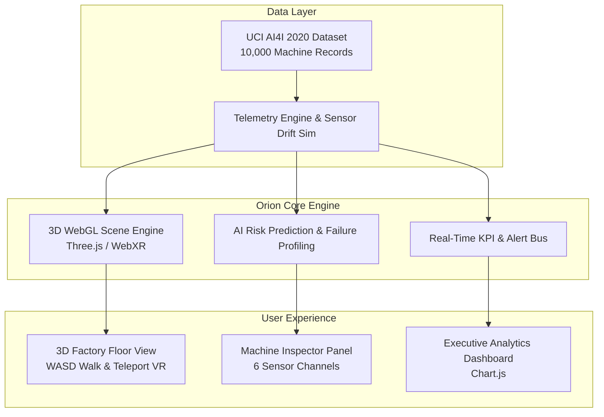

# Orion — Industrial Digital Twin Platform

**Web-native digital twin platform for real-time industrial asset monitoring, AI-driven predictive maintenance, and immersive 3D/VR visualization — powered by real open-source manufacturing data.**

---

## 📌 Overview

**Orion** is a professional, web-native industrial digital twin platform that combines real sensor telemetry, interactive 3D WebGL visualization, AI-powered predictive maintenance, and WebXR VR/AR readiness. It runs entirely in any modern web browser without desktop plugins or proprietary hardware locks.

Orion allows industrial enterprises, research labs, and academic institutions to monitor and validate digital twin concepts rapidly.

---

## ⚡ Quick Start (One-Click Launch)

Run the included launcher script:

```bash
python run_orion.py
```

This will automatically:
1. Start a local HTTP web server at `http://localhost:8000`.
2. Open the **Orion Digital Twin Dashboard** in your default web browser.

---

## 🛠️ System Architecture & Features



### Key Capabilities

| Capability | Orion Delivery |
|---|---|
| **Real-time Telemetry** | Live sensor feeds across 8 CNC machines (Mills, Lathes, Routers), updating every 2.5 seconds |
| **3D WebGL Digital Twin** | Procedural factory floor rendering with rotating spindles, particle emitters, and status rings |
| **AI Predictive Maintenance** | Risk probability scoring powered by 10,000 records from the UCI AI4I 2020 dataset |
| **Interactive Machine Inspector** | Click any 3D asset to view telemetry, maintenance schedule, and AI recommendations |
| **Immersive WebXR VR** | Native VR support (Quest, Vive, Index) with dual-controller teleportation and inspection |
| **Desktop Walk Mode** | WASD + Mouse first-person factory navigation for desktop users |
| **Analytics & Alerts** | Failure distribution, 24-hour sensor trends, and real-time critical/warning alert logging |

---

## 📊 Dataset & Failure Profiles

Orion integrates real industrial data from the **UCI AI4I 2020 Predictive Maintenance Dataset**:
- **10,000 Industrial Records** across 3 product quality variants ($L$, $M$, $H$).
- **5 Tracked Failure Modes**:
  1. **Tool Wear Failure (TWF)**
  2. **Heat Dissipation Failure (HDF)**
  3. **Power Failure (PWF)**
  4. **Overstrain Failure (OSF)**
  5. **Random Failure (RNF)**
- **6 Telemetry Channels**: Air Temperature, Process Temperature, Rotational Speed (RPM), Torque, Tool Wear, and Power Consumption.

---

## 📂 Repository Structure

```
orion/
├── index.html         # Main WebGL 3D Digital Twin Application
├── run_orion.py       # One-click Local Server Launcher
├── README.md          # Project Documentation
├── LICENSE            # Project License
├── ATTRIBUTIONS.md    # Data & Asset Attributions
└── assets/            # Diagrams and Screenshots
```

---

## 📄 License

Distributed under the Creative Commons Attribution-NonCommercial 4.0 (CC BY-NC 4.0) License.
