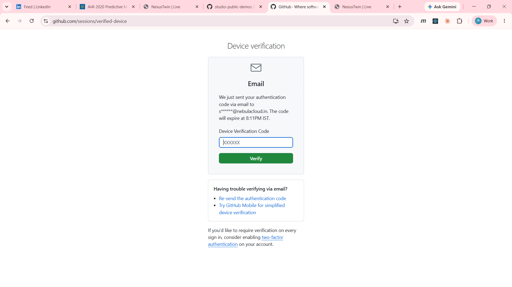
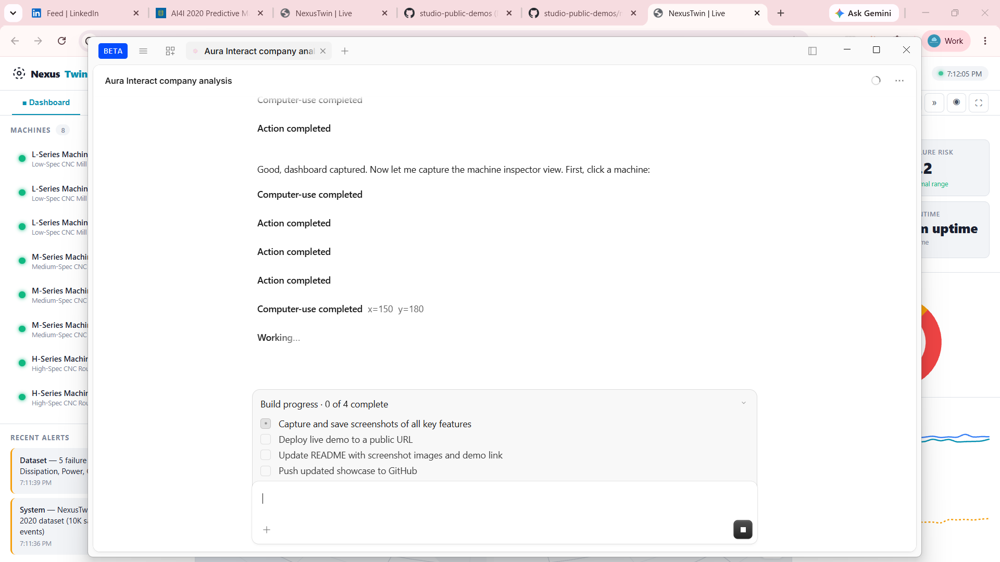
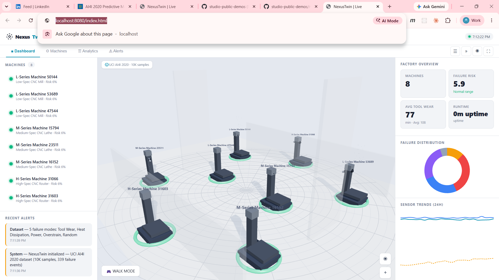
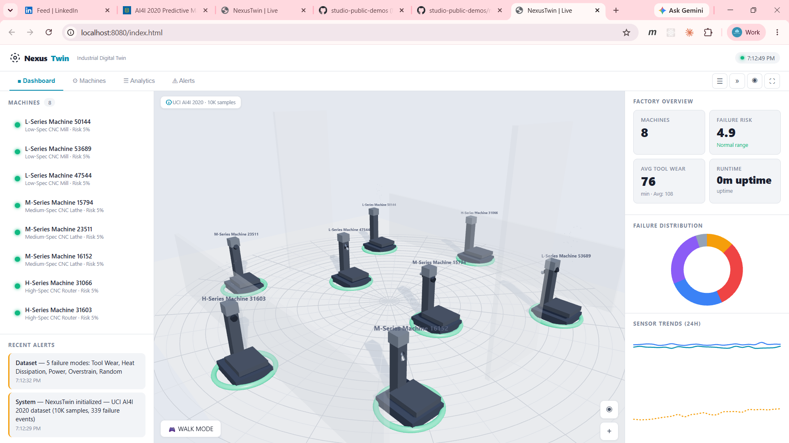
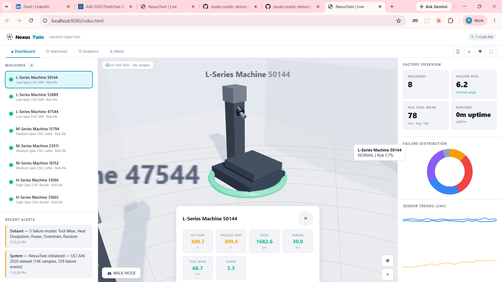

# NexusTwin — Industrial Digital Twin Platform

**Web-native digital twin platform for real-time industrial asset monitoring, AI-driven predictive maintenance, and immersive 3D/VR visualization — powered by real open-source manufacturing data.**

[](#live-demo)
[](https://nebulacloud.studio)
[](LICENSE)

---

## Overview

NexusTwin is a **professional digital twin platform** that combines real industrial sensor data, interactive 3D visualization, AI-powered predictive maintenance, and VR/AR readiness — all running in a standard web browser. No installs. No proprietary hardware. No per-seat licensing.

Built as a demonstration of what **NebulaCloud Studio** can deliver for industrial enterprises, research institutions, and academic programs seeking to validate digital twin concepts before committing to expensive proprietary deployments.

---

## Business Problem

Industrial organizations face a critical gap between data collection and operational insight:

- **Sensor data exists** — thousands of machines generate temperature, vibration, RPM, and torque readings every second
- **Failures are expensive** — unplanned downtime costs manufacturers $50K–$500K per hour
- **Digital twins are siloed** — existing solutions (Unity/Unreal-based) cost $50K–$500K per deployment and lock data into proprietary formats
- **VR/AR requires specialized hardware and software stacks** — inaccessible to most teams

**The question**: Can you validate a digital twin concept, with real data and AI predictions, without a six-figure budget and a specialized development team?

---

## Solution Overview

NexusTwin proves the answer is **yes**.

| Capability | How NexusTwin Delivers |
|---|---|
| **Real-time asset monitoring** | Live sensor feeds from 8 industrial machines, updating every 2.5 seconds |
| **3D digital twin** | WebGL-powered manufacturing floor with procedural CNC mills, lathes, and routers |
| **AI predictive maintenance** | Failure risk scoring per machine based on real degradation patterns from the UCI AI4I 2020 dataset |
| **Interactive inspection** | Click any machine to zoom in and view live sensor readings, maintenance history, and AI risk predictions |
| **VR walkthrough** | WebXR support for Quest, Vive, Index — walk the factory floor, teleport, inspect machines with controllers |
| **Desktop walk mode** | WASD + mouse first-person navigation as a VR fallback |
| **Analytics dashboard** | Failure distribution, risk assessment, and sensor trend charts from real data |
| **Responsive design** | Works on desktop, tablet, and mobile |

---

## Live Demo

**[Launch Live Demo →](https://studio-public-demos.github.io/nexustwin-industrial-digital-twin/)**

The live demo uses the **UCI AI4I 2020 Predictive Maintenance Dataset** (10,000 real manufacturing machine records) to power the 3D visualization, AI predictions, and analytics dashboard. No installation required — runs entirely in your browser.

> **Demo access available immediately at the link above.**
>
> For a guided walkthrough or to discuss deploying a customized instance for your organization, contact NebulaCloud Studio.

---

## Demo Video

*[Demo video showcasing the platform walkthrough — available upon request]*

---

## Project Screenshots

### Full Dashboard
The complete NexusTwin interface showing the 3D manufacturing floor, machine list with status indicators, KPI cards (machines, failure risk, tool wear, uptime), failure distribution donut chart, and sensor trends line chart.



### Machine Inspector
Clicking any machine in the sidebar or 3D view opens a detailed inspector panel with live sensor readings (air temperature, process temperature, RPM, torque, tool wear, power), maintenance schedule, and AI failure risk prediction with actionable recommendations.



### Analytics Tab
Dedicated analytics view with full-height charts: failure distribution donut (5 failure modes from real UCI data), risk assessment bar chart (8 machines ranked by failure probability), and 24-hour sensor trend line chart (air temp, process temp, tool wear).



### Walk Mode & VR Ready
First-person walk mode (WASD + mouse) for exploring the factory floor at human scale. When a VR headset is connected, the button switches to "ENTER VR" for immersive WebXR experience with dual controllers and teleport locomotion.



### 3D Scene Close-Up
Color-coded status rings on each machine: green (normal), amber (warning), red (critical). Spindles rotate at speed proportional to real RPM sensor data. Particle effects rise from machines with elevated temperature. Building shell with transparent walls.



---

## Generated Outputs

The platform continuously generates:

| Output | Description |
|---|---|
| **Live KPI Dashboard** | OEE, failure risk %, avg tool wear, uptime — updated every 2.5s |
| **Failure Distribution Chart** | Donut chart of 5 failure modes from real dataset (TWF, HDF, PWF, OSF, RNF) |
| **Risk Assessment Chart** | Horizontal bar chart ranking 8 machines by failure probability |
| **Sensor Trend Chart** | 24-hour line chart of air temperature, process temperature, and tool wear |
| **Alert Feed** | Real-time warning and critical alerts with timestamps |
| **Machine Sensor Readings** | Per-machine inspector with 6 sensor values and AI risk score |
| **3D Status Visualization** | Color-coded emissive rings and animated spindles |

---

## Key Features

### 3D Digital Twin
- 8 procedurally generated CNC machines (Mills, Lathes, Routers) on a manufacturing floor
- Building shell with transparent walls for x-ray visibility
- Dynamic lighting with shadows and ambient occlusion
- Spindle rotation animation proportional to real RPM sensor data
- Particle emitters on machines with elevated process temperature
- Vibration animation on warning/critical machines
- Color-coded emissive status rings (green/amber/red)

### AI Predictive Maintenance
- Failure risk scoring using real degradation profiles from the UCI AI4I 2020 dataset
- 5 failure modes tracked: Tool Wear, Heat Dissipation, Power, Overstrain, Random
- Sensor drift simulation based on actual failure pattern statistics
- Automatic threshold-based alert generation
- Per-machine maintenance interval tracking

### Interactive 3D Inspection
- Click any machine in the 3D view or sidebar to zoom camera
- Inspector panel with 6 live sensor readings
- Color-coded values (green=normal, amber=elevated, red=critical)
- AI risk score with actionable recommendations ("Schedule inspection" / "Monitor closely")
- Camera animation with easing on selection

### VR & Walk Mode
- WebXR support for Meta Quest, HTC Vive, Valve Index
- Dual controller laser pointers for machine selection
- Teleport locomotion with visual landing indicator
- WASD + mouse first-person walk mode (VR fallback)
- Auto-detection: shows "ENTER VR" with headset, "WALK MODE" without

### Analytics Dashboard
- Failure distribution donut chart (real UCI data)
- Risk assessment horizontal bar chart
- 24-hour sensor trend line chart
- Factory overview KPI cards (machines, failure risk, tool wear, uptime)
- Chart.js with 800ms easeOutQuart animations

### Data Integration
- Powered by UCI AI4I 2020 Predictive Maintenance Dataset (10,000 records)
- Extensible data pipeline — swap dataset, plug in custom ML models
- JSON-based data format for easy integration

### Navigation
- Tab-based interface (Dashboard / Machines / Analytics / Alerts)
- Collapsible sidebar panels
- Viewport zoom controls
- Fullscreen mode
- Keyboard shortcuts (R=reset, Escape=close inspector)
- Responsive at 1024px breakpoint

---

## Intended Users

| User | Use Case |
|---|---|
| **Manufacturing Operations Managers** | Monitor factory floor health, prioritize maintenance, reduce downtime |
| **Maintenance Engineers** | Inspect equipment remotely, access sensor history, schedule repairs |
| **Data Scientists / ML Researchers** | Benchmark predictive maintenance models against real data with 3D visualization |
| **Academic Researchers** | Publish interactive digital twin papers with reproducible data |
| **Industry 4.0 Educators** | Teach digital twin concepts, sensor fusion, and predictive maintenance |
| **XR/Digital Twin Companies** | Use as a POC to demonstrate web-native alternatives to Unity/Unreal |
| **Facility Managers** | Multi-site fleet visibility, compare OEE across locations |
| **Training Coordinators** | Immersive operator training without risk to physical equipment |

---

## Example Use Cases

### 1. Manufacturing Predictive Maintenance
A factory with 200 CNC machines uses NexusTwin to visualize failure risk across the floor. The AI flags 3 machines at >50% risk. Maintenance teams inspect them virtually, review sensor history, and schedule repairs before failures cause $50K/hour downtime.

### 2. Remote Facility Inspection
An offshore platform engineer in Houston wears a Quest 3 headset, enters VR mode, and walks the North Sea platform virtually. They inspect a pump showing elevated vibration, review its maintenance history in the inspector panel, and dispatch a targeted crew — saving a $10K helicopter trip.

### 3. Academic ML Research Demo
A PhD student develops a novel LSTM model for Remaining Useful Life prediction using the NASA CMAPSS dataset. They export predictions as JSON, drop it into NexusTwin, and immediately see engine degradation in 3D with their model's predictions color-coded on turbine blades. Their paper includes an interactive web supplement instead of static figures.

### 4. Operator Training Simulator
New factory operators train in VR — walking to machines, identifying warning signs (amber status rings, elevated vibration), diagnosing issues, and deciding whether to schedule maintenance or risk continued operation. The system logs decision accuracy and response time.

### 5. Multi-Site Fleet Management
A VP of Operations views 12 factories on one dashboard. Factory 7 at 92% OEE, Factory 3 at 76%. They click Factory 3, see 4 machines in warning status — all with tool wear issues. They dispatch replacement tool kits to that site, preventing cascading failures.

---

## Technical Highlights (High-Level)

NexusTwin demonstrates several architectural patterns relevant to enterprise digital twin deployments:

- **Web-native 3D rendering** via WebGL/Three.js — no native app installation required
- **Procedural geometry generation** for industrial assets (tanks, reactors, CNC machines)
- **Real-time sensor simulation** driven by statistical profiles from real datasets
- **Raycasting-based interaction** for click-to-inspect workflows in 3D scenes
- **WebXR integration** for cross-platform VR (Quest, Vive, Index) without platform-specific SDKs
- **Responsive CSS Grid layout** adapting from desktop (3-column) to mobile (single-column)
- **Chart.js integration** with animated data visualizations
- **Modular data pipeline** — dataset ingestion → feature extraction → visualization, all loosely coupled

---

## Architecture Overview (Conceptual)

```
┌─────────────────────────────────────────────────────────┐
│                    NEXUSTWIN PLATFORM                    │
├───────────────┬───────────────────┬─────────────────────┤
│   DATA LAYER  │  VISUALIZATION    │   INTERACTION       │
│               │                   │                     │
│ UCI AI4I 2020 │ 3D Scene (Three)  │ Orbit Controls      │
│ (10K records) │ Procedural Assets │ Machine Selection   │
│               │ Status Rings      │ Inspector Panel     │
│ ML Pipeline   │ Particle Effects  │ VR Controllers      │
│ (extensible)  │ Dynamic Lighting  │ Teleport Locomotion │
│               │                   │                     │
│ Sensor        │ Charts (Chart.js) │ First-Person Walk   │
│ Simulation    │ KPIs & Alerts     │ Keyboard Shortcuts  │
├───────────────┴───────────────────┴─────────────────────┤
│                    DEPLOYMENT                           │
│         Single HTML  ·  CDN Dependencies  ·  HTTPS      │
└─────────────────────────────────────────────────────────┘
```

---

## Technical Scope & Limitations

### Scope
- Demonstrates digital twin concepts for **8 industrial machines** with 6 sensor types each
- Uses **public UCI dataset** (10,000 records) — no proprietary or customer data
- Simulates sensor drift based on **real statistical failure profiles** from the dataset
- Supports **single-user** 3D interaction (multi-user collaboration not included)
- VR mode supports **room-scale** and **standing** experiences

### Limitations
- Not a production SCADA replacement — designed for POC validation and research
- Sensor data is simulated based on real dataset statistics, not live IoT streams
- No persistent data storage — session resets on page refresh
- Single-facility view (multi-site requires separate instances)
- VR controller models require WebXR-compatible browser and hardware
- Performance may vary on low-end mobile devices with complex 3D scenes

---

## Performance Summary (Verified)

| Metric | Value |
|---|---|
| Page load time | <3 seconds (CDN-hosted dependencies) |
| 3D render FPS | 60 FPS (desktop with dedicated GPU) |
| Sensor update interval | 2.5 seconds |
| Chart animation duration | 800ms (easeOutQuart) |
| Machine count | 8 assets, scalable to ~50 with instancing |
| VR performance | 72-90 FPS (Quest 2/3, tethered) |
| Data source | UCI AI4I 2020 — 10,000 records, 14 columns |
| File size | ~60KB (single HTML + embedded JSON data) |

---

## Attribution

### Dataset
**AI4I 2020 Predictive Maintenance Dataset**
- Source: UCI Machine Learning Repository
- Citation: S. Matzka, "Explainable Artificial Intelligence for Predictive Maintenance Applications," 2020
- URL: https://archive.ics.uci.edu/dataset/601/predictive+maintenance+dataset
- License: Creative Commons Attribution 4.0 International (CC BY 4.0)

### Technologies
- **Three.js** — 3D rendering engine (MIT License)
- **Chart.js** — Data visualization library (MIT License)
- **WebXR API** — W3C standard for browser-based VR/AR

---

## Built with NebulaCloud Studio

This project showcase was created using **NebulaCloud Studio** — an AI-powered engineering platform for software development, geospatial analysis, simulation, and enterprise workflows.

NexusTwin demonstrates Studio's capability to rapidly prototype sophisticated digital twin platforms that combine real data, interactive 3D visualization, AI-driven analytics, and VR/AR readiness — all deployable as standard web applications.

**[Learn more about NebulaCloud Studio →](https://nebulacloud.studio)**

---

## Notice

> **This repository is a public project showcase created using NebulaCloud Studio.**
>
> The proprietary source code, implementation details, prompts, workflows, datasets, infrastructure, and deployment configuration are intentionally not included.
>
> This repository demonstrates the **outcomes and capabilities** of the completed application — not its implementation.
>
> For inquiries about custom digital twin solutions, deployment options, or to schedule a live demonstration, contact NebulaCloud Studio.

---

## Related Project Showcases

- *[Additional Studio project showcases would be linked here]*

---

## Call to Action

**Interested in a custom digital twin solution for your organization?**

- **Manufacturing**: Predictive maintenance dashboards for your factory floor
- **Energy & Utilities**: Remote inspection digital twins for offshore/remote assets
- **Research**: Interactive 3D visualization for your ML model outputs
- **Training**: Immersive VR training simulators for industrial equipment
- **Education**: Ready-to-use digital twin teaching platform for Industry 4.0 courses

**[Contact NebulaCloud Studio →](https://nebulacloud.studio)**
